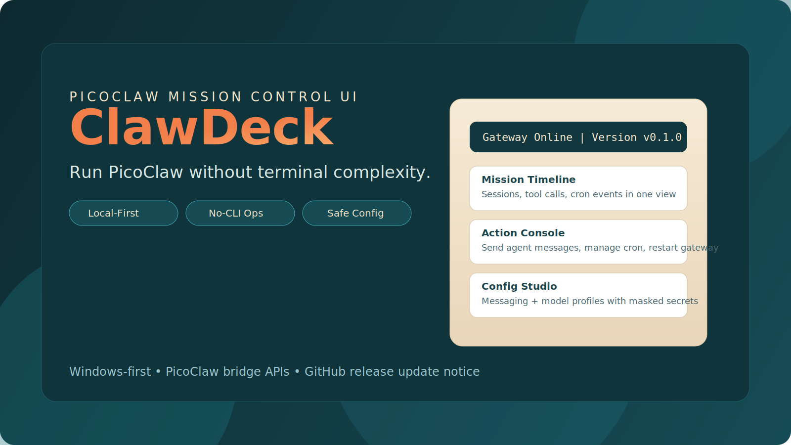
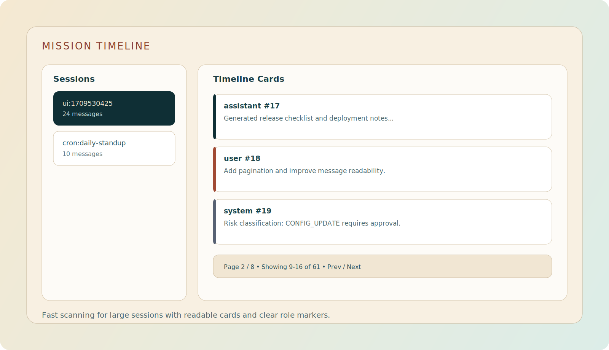
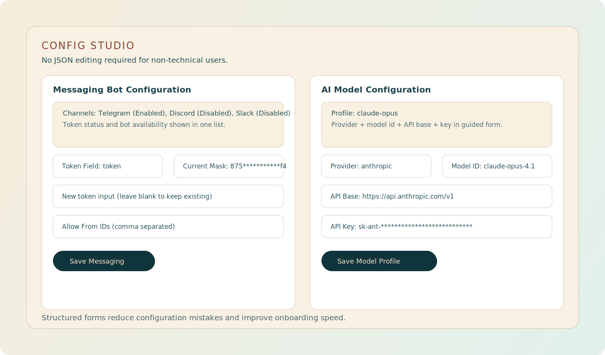
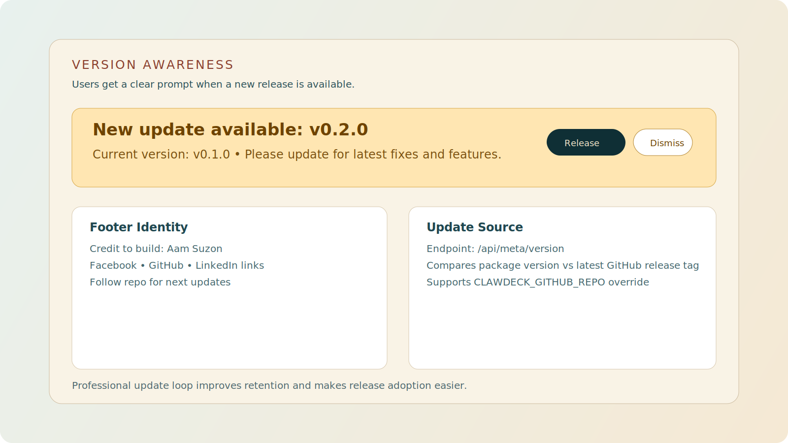

# ClawDeck

<p align="center">
  
</p>

<p align="center">
  <strong>Mission Control UI for PicoClaw</strong><br />
  Local-first. Windows-first. No terminal required.
</p>

<p align="center">
  <a href="https://github.com/aamsuzon/ClawDeck/stargazers"></a>
  <a href="https://github.com/aamsuzon/ClawDeck/releases"></a>
  
  
  
</p>

## Official PicoClaw (Viral Preview)

<p align="center">
  
</p>

## Why ClawDeck

PicoClaw is powerful, but many users struggle with terminal-first workflow.  
ClawDeck turns PicoClaw into a visual control center so non-programmer users can run daily operations safely.

### What users can do easily
- Check gateway and workspace health
- Browse session history and timeline
- Send agent messages without terminal
- Create/manage cron jobs from UI
- Configure messaging bot tokens with form fields
- Configure AI model API keys with guided profile form
- See release update alerts in-app

## PicoClaw Windows Download (Official)

- PicoClaw Releases: https://github.com/sipeed/picoclaw/releases
- Direct latest Windows x64 EXE:  
  https://github.com/sipeed/picoclaw/releases/latest/download/picoclaw-windows-amd64.exe

## Quick Start (5 Minutes)

### 1) Install PicoClaw

Download and install PicoClaw (Windows) from the official release links above.

### 2) Install ClawDeck

```powershell
cd C:\Projects
git clone https://github.com/aamsuzon/ClawDeck.git
cd ClawDeck
npm install
```

### 3) Run ClawDeck

```powershell
npm run dev
```

Open: `http://localhost:3000`

## First Use Flow (Non-CLI Friendly)

1. Open ClawDeck and click `Refresh`.
2. Confirm top badges: `Gateway Online` and `Workspace Ready`.
3. Go to `Configuration Center`:
   - Messaging Bot Configuration: select channel, set token, save.
   - AI API Key Configuration: create/select model profile, set API key, save.
4. Go to `Action Console` and run a test agent message.
5. Add cron jobs from UI if needed.

## Product Visuals

<p align="center">
  
</p>

<p align="center">
  
</p>

<p align="center">
  
</p>

## Feature Breakdown

### Mission Timeline
- Pagination for long histories
- Load more/show less for large messages
- Tool-call inspection in expandable block

### Action Console
- Send agent message
- Restart gateway (high-risk confirmation)
- Create, enable, disable, remove cron jobs

### Config Studio (Form-Based)
- Bot/channel list with token status visibility
- Token field selector for different channel schemas
- AI model profile create/update flow
- Masked secrets for safer local operation

### Update Awareness
- Shows current version in UI header
- Checks latest GitHub release
- Prompts user when update is available

## API Surface

| Method | Endpoint | Purpose |
|---|---|---|
| GET | `/api/bridge/health` | Gateway and workspace status |
| GET | `/api/bridge/sessions` | Session list |
| GET | `/api/bridge/sessions/:id` | Session detail |
| GET | `/api/bridge/cron` | Cron list |
| POST | `/api/bridge/cron` | Create cron |
| PATCH | `/api/bridge/cron/:id` | Enable/disable/remove cron |
| POST | `/api/bridge/agent/message` | Send agent message |
| GET | `/api/bridge/config/safe` | Redacted config |
| GET | `/api/bridge/config/ui` | Structured config for UI |
| PUT | `/api/bridge/config/ui/messaging` | Update messaging config |
| PUT | `/api/bridge/config/ui/model` | Update/create model profile |
| POST | `/api/bridge/gateway` | Gateway control |
| GET | `/api/meta/version` | Current vs latest release |

## Production Run

```powershell
npm run build
npm run start
```

## Environment (Optional)

To point update-checker to another repo:

```powershell
# temporary
$env:CLAWDECK_GITHUB_REPO="owner/repo"

# permanent
setx CLAWDECK_GITHUB_REPO "owner/repo"
```

## Troubleshooting

### Gateway offline
- Ensure PicoClaw process is running.
- Check gateway host/port in PicoClaw config.
- Click `Refresh`.

### Token not set
- Select correct channel.
- Select correct token field.
- Save config again.

### Git push/auth issues
- Use HTTPS login or configure SSH keys.

## Public Roadmap

- Better onboarding wizard for first-time users
- Richer diagnostics for bot channels
- More timeline search/filter controls
- Contributor templates and plugin extension points

## Credit

Built by **Abdullah Al Mahamud**

- Facebook: https://facebook.com/aamsuzon
- GitHub: https://github.com/aamsuzon
- LinkedIn: https://www.linkedin.com/in/aamsuzon/

If this project helps you, please star the repo and follow for updates.

